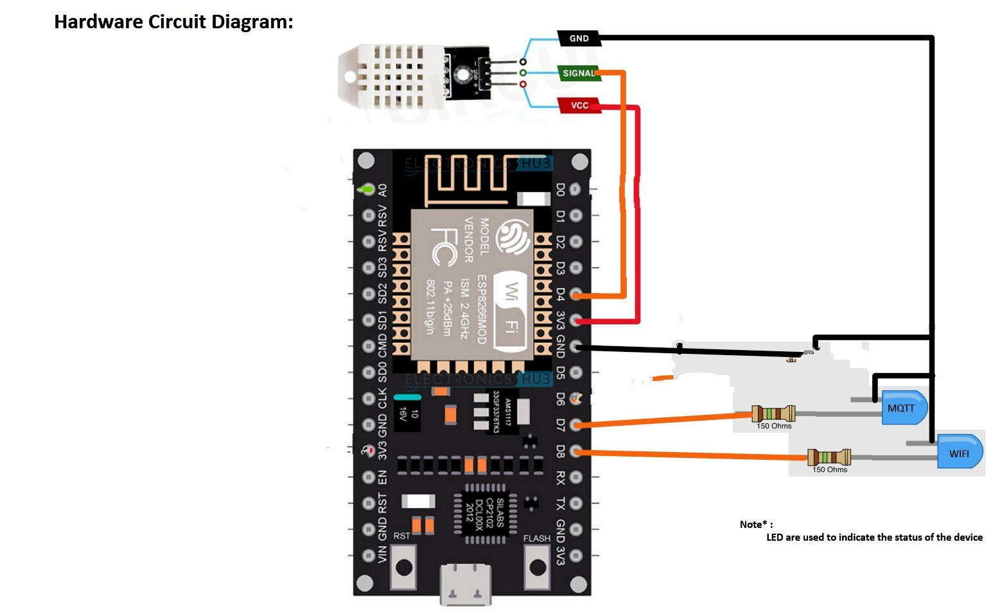
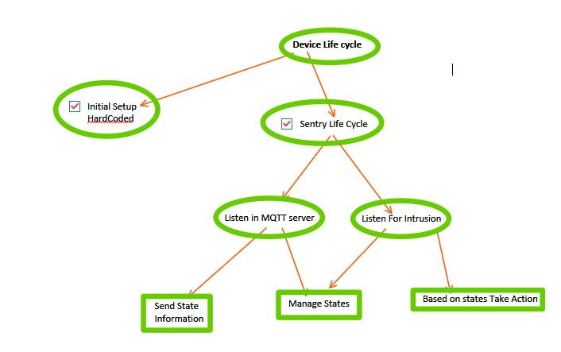
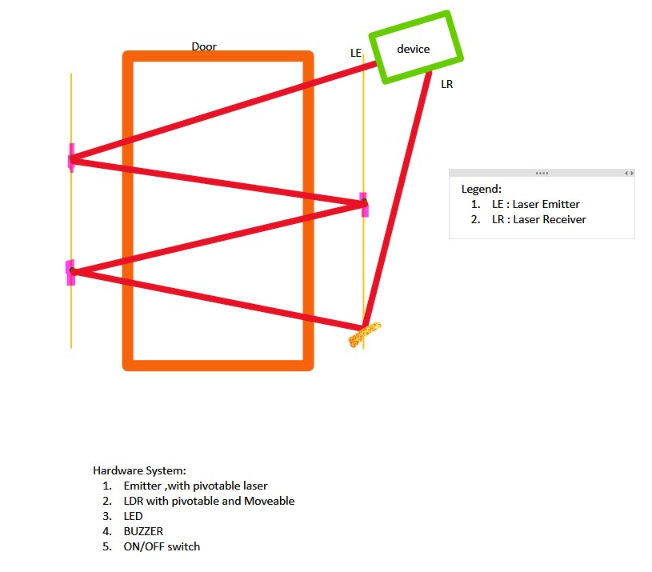
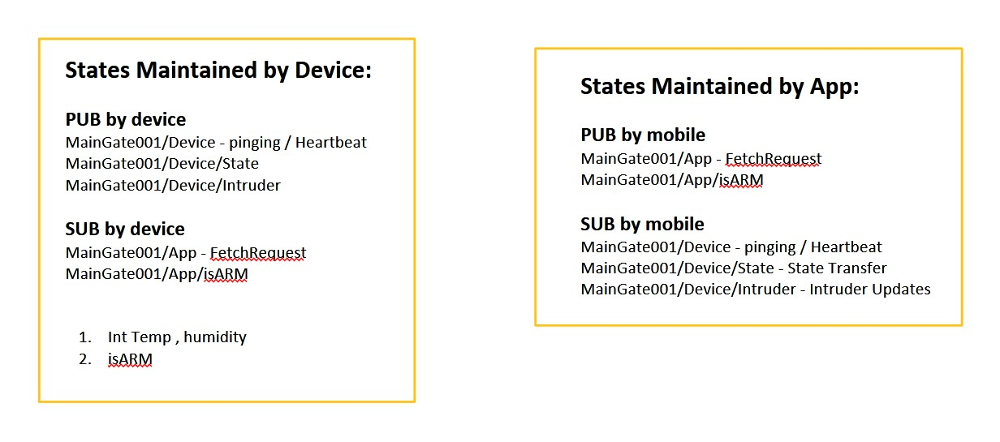

Here’s the updated **SolarDehydrator** README with the additional links for setting up LittleFS and the SSL certificate under the "Getting Started" section:

---

# SolarDehydrator

This project aims to create a comprehensive solar-powered food dehydrator system using hardware components integrated with a mobile application. The primary objective is to establish secure communication with the highly scalable and reliable HiveMQ MQTT server. The system will publish updates to a specific topic to notify users about temperature and humidity levels, ensuring optimal food dehydration conditions. Additionally, the system will integrate with a mobile phone application for easy user interaction and control.

## Purpose

The main purpose of this project is to enhance food preservation methods by leveraging solar energy and modern technology. By utilizing real-time environmental monitoring of temperature and humidity, users can ensure that food dehydration is occurring under optimal conditions. The integration with the HiveMQ MQTT server ensures reliable and scalable communication between the hardware components and the mobile application, allowing for efficient remote management and monitoring.

## Features

- **Secure Communication:** Establishes secure communication with the HiveMQ MQTT server to ensure data integrity and confidentiality.
- **Environmental Monitoring:** Monitors temperature and humidity levels in real-time to optimize the food dehydration process.
- **Mobile Integration:** Integrates with a mobile phone application for easy user interaction, monitoring, and control of the dehydration process.
- **Solar Power:** Utilizes solar energy for environmentally friendly and cost-effective operation.
- **Scalability:** The system is highly scalable, allowing for easy expansion and integration with additional sensors or devices.

## Getting Started

To set up the SolarDehydrator system, follow these steps:

1. **Hardware Setup:** Refer to the provided hardware schematics and circuit diagram (see `screenshots/CircuitDiagram.jpg` and `screenshots/HardwareSchematics1.jpg`) for guidance on setting up the hardware components, including solar panels and sensors.

2. **Sensor Calibration:** Calibrate the temperature and humidity sensors for accurate measurements (see `screenshots/SensorCalibration.jpg`).

3. **Mobile Application:** Download and install the mobile application from the [SolarDehydratorApp repository](https://github.com/Michael-Pio/SolarDehydratorApp).

4. **LittleFS Setup:** For setting up the LittleFS file system on your ESP8266, follow the detailed guide provided by Random Nerd Tutorials:  
   [ESP8266 LittleFS Setup using VS Code and PlatformIO](https://randomnerdtutorials.com/esp8266-nodemcu-vs-code-platformio-littlefs/).

5. **SSL Certificate Setup:** To set up an SSL certificate for secure communication, refer to this video tutorial:  
   [How to Set Up SSL Certificates for MQTT](https://www.youtube.com/watch?v=qmBLflLLj4s).

6. **Configuration:** Configure the mobile application to connect to the HiveMQ MQTT server and subscribe to the appropriate topic for real-time updates on temperature and humidity levels.

7. **Testing:** Test the system by running the dehydrator in different weather conditions, verifying that temperature and humidity data are published to the MQTT server and reflected in the mobile application.

## Screenshots

*Figure 1: Circuit Diagram*

*Figure 2: Device Lifecycle*

*Figure 3: Hardware Schematics*

*Figure 4: Sensor Calibration*

*Figure 5: MQTT States Maintained*

## Contributors

- **Michael Pio**: Lead Developer - [GitHub Profile](https://github.com/Michael-Pio)

## License

This project is licensed under the [MIT License](LICENSE). See the LICENSE file for details.

---

The "Getting Started" section now includes the specific links to help with setting up LittleFS and configuring an SSL certificate. Let me know if you need further changes!